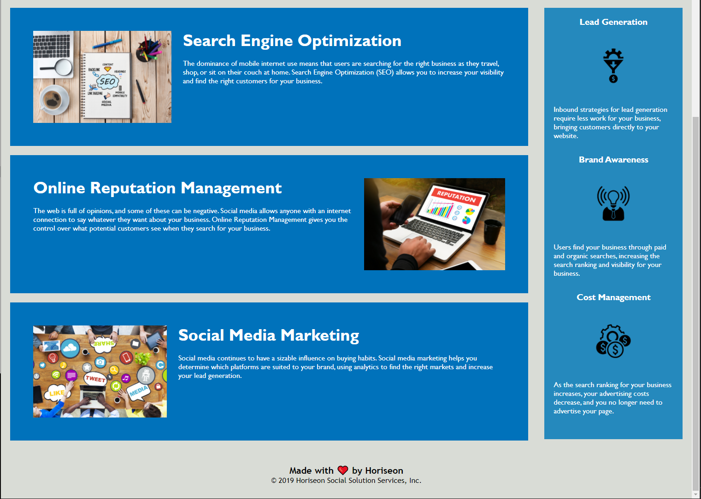

# 01 HTML CSS Git: Code Refactor

## Summary:

<span style="color:yellow">Assignment 01</span>

After reviewing the README of the Code Refactor homework task, I read through the provided HTML and CSS documents side by side to try and identify any areas that required changes or amendments that were inline with the provided User Stories and Acceptance Criteria, from which I then began to list out as bullet points.

Following this I then began to work systematically down through the .html file and address each HTML block in turn. Where applicable I used online resources to research additional detail on how to correct and or change issues. If I identifed more issues as I worked through the changes to the documents, I would add them to the Issues Identified list.

Upon editing each HTML block containing a corresponding CSS Selector I turned to the .css file to edited the selectors to reflect my amendments within the HTML, and also consolidate any duplicate CSS.

I then added comments to both of the HTML and CSS files, and then reorganised the code in the .css file to reflect the .html structure, and comment order.

---
<br>

## Issues Identified:

*	There is no meta information:
    * Viewport - <span style="color:red">Although there is no user story or criteria for responsive design, this is an important accessibility feature that I would advise upon.</span>
    * Description 
    * Keywords 	
    * Author
*	The site title is not displaying the Company name.
*	Semantics are not being used. All HTML blocks are wrapped in ```<div>``` elements. 
*	There are no comments within the CSS or HTML documents.
*	The CSS file contains a lot of repeated code.
*	The Search Engine Optimization id is missing from the content, so the Nav link doesn't work.
*	No ```alt``` attribute for any of the `````` elements.
*   Incorrect closing tag on the Cost Management `````` element.
---
<br>

## Changes Implemented:

<span style="color:yellow">.html document:</span> 
<br>

*	ADDED meta tags with content to the head of the HTML document:
	*	Description
	*	Keywords
	*	Author	
	*	Viewport
*	ADDED a title that reflects the company name ‘Horiseon’ and a small description, this now 	displays in the webpage tab.
*	EDITED the first ```<div>``` element of the header, and replaced the ```<div>``` with the ```<header>``` 	semantic element.
*	EDITED the ```<div>``` element of the ```<nav>``` contained within the ```<header>```, and replaced the ```<div>``` with the 	```<nav>``` semantic element.	
*	EDITED the Hero Section ```<div>``` and replaced it with the ```<section>``` semantic.
* ADDED a ```<main>``` semantic section and moved the content and sidebar into it.
*	EDITED the content section and renamed it to ```<artcle>```.
*	EDITED the elements within the content section and renamed them to ```<section>```.
*	EDITED the benefits sidebar ```<div>``` and renamed to ```<aside>```.
*	ADDED the ```alt``` attribute to the three ```<aside>``` ```img``` elements.
*	EDITED the ```<div>``` element of the footer, and replaced the ```<div>``` with the ```<footer>``` 	semantic element.
* ADDED the ```id``` of ```Search Engine Optimization``` to the Search Engine Optimization section, to fix Nav link.
*	ADDED comments to divide and identify each HTML block.
<br>

<span style="color:yellow">.css document:</span>
<br>

*   REMOVED ```nav``` from the ```.header``` class.
*	EDITED the CSS ```.footer``` class to target the ```<footer>``` semantic element.
*	MERGED the CSS classes containing duplicate code using the dry principle.
*	ADDED comments to the code to separate the sections to reflect the HTML structure.
*	REORDERED the CSS code  and placed into its respective commented section.

---
<br>

## Site Details

*   Please use this [Horiseon](https://loosekonnection.github.io/CodeRefactor/)  link to view the site:   

*   Below are two screenshots of the site looks.




---

## Credits - Sites used for research:
<br>

*   HTML5 Semantic Elements In Depth | HTML5 | [#assemblyJS](https://www.youtube.com/watch?v=17vYHaf1E-A)
*   HTML5 Semantic Tags: What Are They and [How To Use Them!](https://www.semrush.com/blog/semantic-html5-guide/)
*   SEO Recommendations: [Mediacom](https://www.mediacom.com/)
*   Meta Description & SEO: [MOZ](https://moz.com/learn/seo/meta-description)
*   CSS Selectors and Best Practices [Stack Overflow](https://stackoverflow.com/)
*   Disallow Qualified Heading [GitHub](https://github.com/CSSLint/csslint/wiki/Disallow-qualified-headings)

---
<br>


<br>

---
© 2020 Loosekonnection, Working towards being a Full Stack Dev.